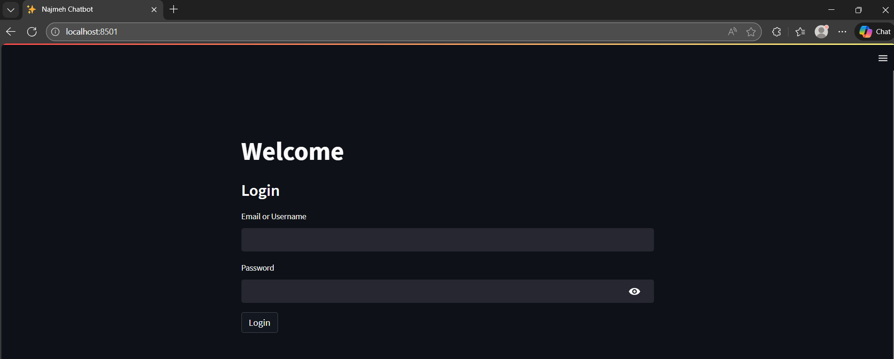
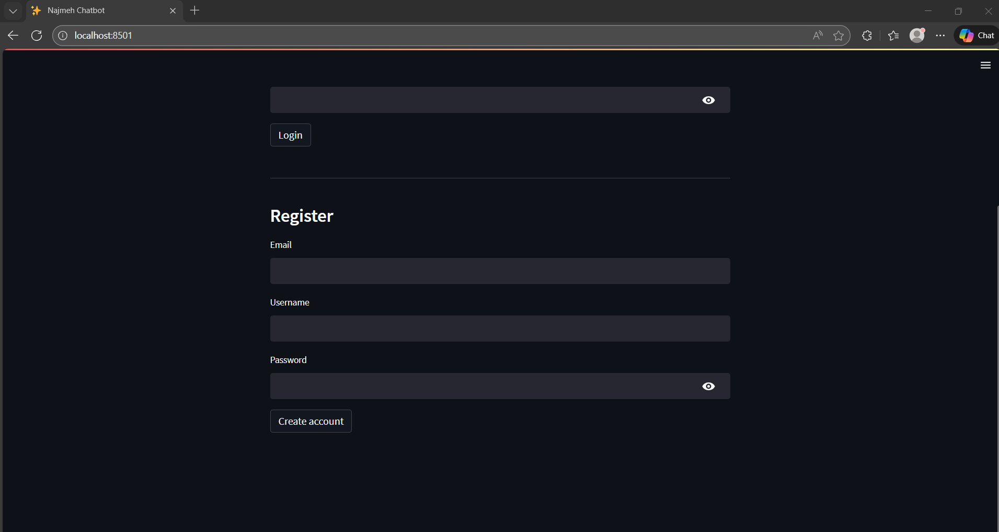
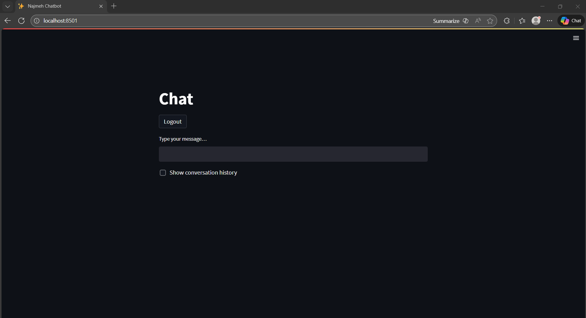
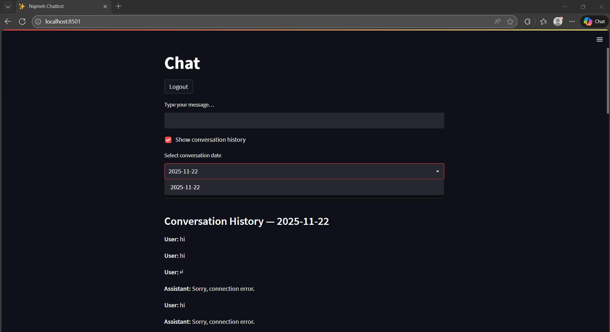

# Najmeh Chatbot

This is a clean, minimal, and production-ready Streamlit chatbot that blends elegant UI/UX with robust authentication, conversation history, and EdenAI integration. It’s built to feel personal, secure, and scalable.

---

## Overview

A streamlined chat experience:

- Auth first: Users see Welcome, Login, Register. On login, they enter Chat.
- Minimal UI: Single input, clear responses, optional history toggle.
- Persistent history: Conversations saved per user; view by date.
- Provider-agnostic: EdenAI client decouples model/provider choice.
- Graceful failures: Clear fallbacks for API errors and empty input.

---

## Features

- **Auth and sessions:** Secure login/register with session-aware views.
- **Chat Service:** Full turn handling with user-conversation linkage.
- **History by date:** Select a past conversation by its creation date.
- **EdenAI client:** Pluggable provider and model configuration.
- **Error Handling:** Payment errors, connection issues, empty inputs.

---

## Demo
- Welcome and login screen

  
  

- Chat interface with responses

  

- Conversation history by date

  

---

## Quick Start

### Prerequisites
- Python 3.10+
- Streamlit, SQLModel, Requests
- EdenAI API key 

### Installation
- Clone the repository
- Create a virtual environment
- Install dependencies from requirements.txt
```bash
  git clone https://github.com/nakhani/Streamlit/tree/8c23d2e6d33046cb310b1e8ade4036f0862e4dc3/Chatbot
  cd chatbot
  python -m venv .venv
  source .venv/bin/activate #On Windows: .venv\Scripts\activate
  pip install -r requirements.txt
```


### Environment Variables
Create a `.env` or set system envs:
- **DB_URL**: SQLAlchemy/SQLModel URL (e.g. sqlite:///app.db)
- **EDENAI_API_KEY**: Real EdenAI API key
- **EDEN_PROVIDER**: Provider name (e.g., openai, google)
- **EDEN_MODEL**: Model name (e.g., gpt-3.5-turbo, gemini-pro)

Example .env:

```bash
  DB_URL=sqlite:///app.db
  EDENAI_API_KEY=your_real_edenai_key
  EDEN_PROVIDER=openai
  EDEN_MODEL=gpt-3.5-turbo
```

### Run

```bash
streamlit run app.py
```


---

## Project Structure

```text
.
├─ app.py
├─ settings.py
├─ db/
│  ├─ engine.py
│  └─ models.py
├─ auth/
│  ├─ service.py
│  └─ widgets.py
├─ ai/
│  └─ eden_client.py
├─ chat/
│  ├─ service.py
│  └─ repositories.py
├─ docs/
│  └─ images/
└─ requirements.txt
```

- **app.py**: Streamlit UI and flow
- **settings.py**: Configuration
- **db/**: Database engine and models
- **auth/**: Authentication services and widgets
- **ai/**: EdenAI client
- **chat/**: Conversation services and repositories
- **docs/**: Images for documentation

---

## Usage

- Login or register
- Send a message and receive bot response
- Date of conversation displayed with each response
- Toggle history to view past conversations by date

---

## Acknowledgements

- Streamlit
- SQLModel
- EdenAI
