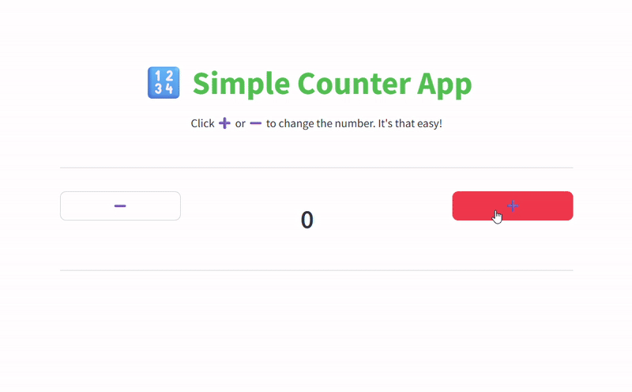

# 📦 Streamlit Projects

Welcome to my collection of Streamlit apps! This repository includes two fun and functional projects:

---

## 1️⃣ Counter App

A playful counter app built with Streamlit.

### 🔧 Features
- Increment and decrement buttons
- Live counter display
- Minimalist layout using `st.columns`

### Demo


### 🚀 Deployment

This app is deployed using **Docker** on [Liara](https://liara.ir/), a powerful cloud platform for developers.

🔗 **Live App**: [Click here to view and use the Counter App online](https://your-liara-app-url.com)  

---

## 2️⃣ Simple Data Science App

An interactive app for exploring CSV data using Streamlit.

### 🔧 Features
- 📁 Upload `.csv` file
- 📋 Display data in a table
- 📊 Visualize data with charts
- 📝 Sidebar with app description

### Demo


### 🚀 Deployment

This app is deployed for free using **Streamlit Community Cloud**.
🔗 **Live App**: [Click here to view and use the Counter App online](https://your-liara-app-url.com) 

---

## 📦 Installation (Optional for Local Use)

If you'd like to run these apps locally:

```bash
# Clone the repository
git https://github.com/nakhani/Streamlit/tree/58295330f66ea48ed30fd7c64e6942b1c714a419/Hello_streamlit
cd Hello_streamlit
```
Open each folder of project you want and:

```bash
# Install dependencies
pip install -r requirements.txt
```

Then:

```bash
# Run the app
streamlit run counter_app.py 
or 
streamlit run datascience_app.py 
```

---
## Technologies Used

- Python
- Streamlit
- Pandas
- Altair
- Docker
- Liara


